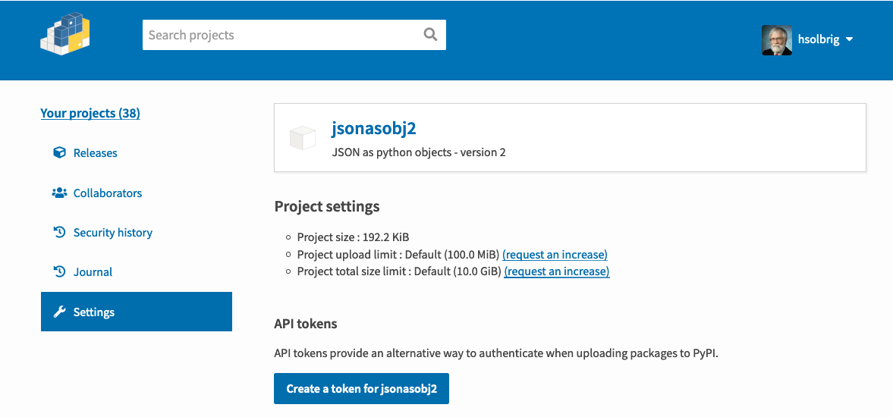
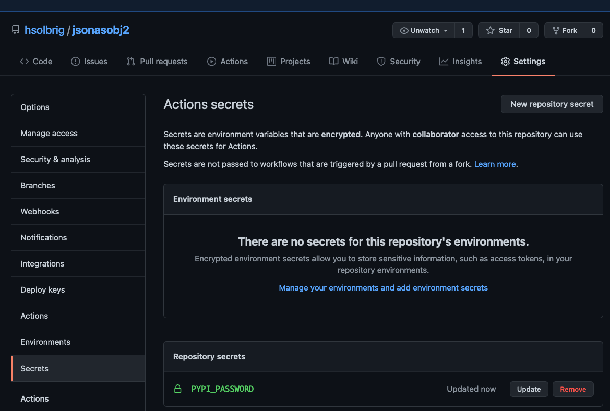
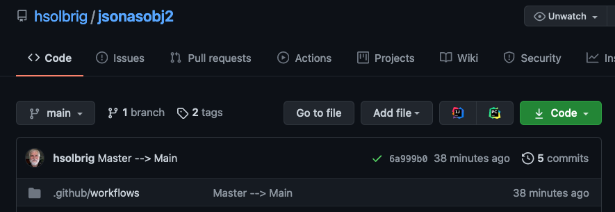
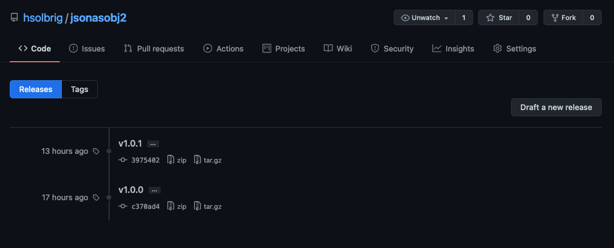

# Setting up a new PyPi repository
This document contains some notes on how to set up a new linkml derived model in [PyPi](https://pypi.org/)

For the purposes of this example, we will pretend that you have created a new LinkML model,  `my-cool-model` in your
repository.

## Prerequisites
1) A PyPi login
2) `my-cool-model` builds and passes all unit tests  

## Process

1) Commit all changes
```bash
> git commit -am "Ready for testing..."
> git status
On branch main
Your branch is up to date with 'origin/main'.

nothing to commit, working tree clean
>
```
2) Create the initial PyPi distro
```bash
> git tag v0.0.1
> rm -f dist/*
> python setup.py sdist bdist_wheel
...
creating 'dist/my-cool-model-0.0.1-py3-none-any.whl' and adding 'build/bdist.macosx-10.9-x86_64/wheel' to it
adding 'my-cool-model-0.0.1.dist-info/AUTHORS'
adding 'my-cool-model-0.0.1.dist-info/METADATA'
adding 'my-cool-model-0.0.1.dist-info/WHEEL'
adding 'my-cool-model-0.0.1.dist-info/pbr.json'
adding 'my-cool-model-0.0.1.dist-info/top_level.txt'
adding 'my-cool-model-0.0.1.dist-info/RECORD'
removing build/bdist.macosx-10.9-x86_64/wheel
> list dist
my-cool-model-1.0.1-py3-none-any.whl my-cool-model-1.0.1.tar.gz
>
```
If the tags above show up with a `dev1` suffix on them, something has changed since the tag.  If this occurs, you can
go ahead and find what got missed in the commit, fix and commit it and grab the next tag (v0.0.2 in this example) and
redo the setup.
3) Upload the commit to pypi:
```bash
> twine upload dist/*
Uploading distributions to https://upload.pypi.org/legacy/
Enter your username: <pypi user name>
Uploading my-cool-model-0.0.1-py3-none-any.whl
100%|██████████████████████████████████████| 10.4k/10.4k [00:02<00:00, 4.93kB/s]
Uploading my-cool-model-0.0.1.tar.gz
100%|██████████████████████████████████████| 96.0k/96.0k [00:01<00:00, 58.7kB/s]

View at:
https://pypi.org/project/my-cool-model/0.0.1/
```
4) Push the initial tag info to github
```bash
> git commit -am "Created initial distro"
> git push --tags
```

5) Create an OAUTH2 token from the PyPi site
   
Note: the examples below show this process using a real project, `jsonasobj2`.  You will be using `my-cool-model` in its 
stead:

__log in to pypi__
    


__select the Manage button for your project__


__select _Settings___


__select _Create a token for my-cool-model___


__label the token _github_my-cool-model___ (or something similar), and `my-cool-project` in the Scope window:


__Copy the token to the clipboard__
Note that this is the only time you will see this token -- once you leave this web page, the token cannot be
retrieved.


__Navigate to the settings/secrets tab of the github repository for your project__


__Select _New repository secret_.__

Name the token "pypi_password", paste the token you copied above into the _Value slot and click _Add secret_



6) Test the newly created token:

__Navigate to the home page or your repository and select the _tags_ tab:__


__Select _Releases_ and then _Draft a new release_



__Enter the next sequential (or otherwise appropriate) tag version, as "v" followed by the appropiate 
[semantic version](https://semver.org/)__


__Select _Publish release___


__The _Actions_ tab will show you the status of your publish__


__When the action rolls over to <span style="color:green">green</span>, your newest version will be in PyPi__


__And the new release will be available for download and use__


