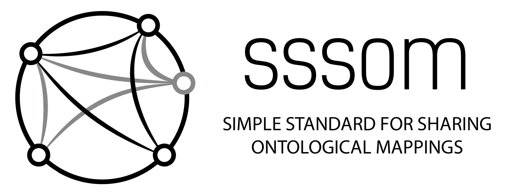

<!--[](https://zenodo.org/badge/latestdoi/13996/mapping-commons/sssom)-->

# A Simple Standard for Sharing Ontological Mappings (SSSOM)




SSSOM is a Simple Standard for Sharing Ontological Mappings, providing 

1. a TSV-based representation for ontology term mappings
1. a comprehensive set of standard metadata elements to describe mappings and 
1. a standard translation between the TSV and the Web Ontology Language (OWL). 

The SSSOM TSV format in particular is geared towards the needs of the wider bioinformatics community as a way to safely exchange mappings in an easily readable yet semantically well-specified manner. Consider this example of a simple mapping file:

| subject_id	| predicate_id	| object_id	| mapping_justification | subject_label	| object_label |
| --- | --- | --- | --- | --- | --- |
| HP:0009124	| skos:exactMatch	| MP:0000003	| semapv:LexicalMatching	| Abnormal adipose tissue morphology	| abnormal adipose tissue morphology |
| HP:0008551	| skos:exactMatch	| MP:0000018	| semapv:LexicalMatching	| Microtia	| small ears |
| HP:0000411	| skos:exactMatch	| MP:0000021	| semapv:LexicalMatching	| Protruding ear	| prominent ears |

SSSOM specifies all its metadata elements:

- subject_id
- predicate_id
- object_id
- mapping_justification (*NOTE: Since June 2022* `match_type` is being replaced by `mapping_justification` see [here](https://github.com/mapping-commons/sssom/issues/150))
- subject_label
- object_label

including clear definitions, examples of use and controlled vocabulary where necessary, along with 30 other optional metadata elements to provide additional provenance.

SSSOM further provides a standard way to 
- augment the TSV file with mapping set - level metadata, such as creator_id, mapping_date or license and
- translate a SSSOM compliant TSV files into _OWL reified axioms_. This will allow the easy loading, and merging of SSSOM mapping tables into existing ontologies using standard tools such as ROBOT (under development).

Note that SSSOM is currently under development and subject to change. Please leave us a comment on the [issue tracker](https://github.com/OBOFoundry/SSSOM/issues) if you want to be involved. The full specification can be found [here](https://w3id.org/sssom/spec).

## Citation

If you have found SSSOM to be helpful in your work, please consider citing:

Nicolas Matentzoglu, James P Balhoff, Susan M Bello, Chris Bizon, Matthew Brush, Tiffany J Callahan, Christopher G Chute, William D Duncan, Chris T Evelo, Davera Gabriel, John Graybeal, Alasdair Gray, Benjamin M Gyori, Melissa Haendel, Henriette Harmse, Nomi L Harris, Ian Harrow, Harshad B Hegde, Amelia L Hoyt, Charles T Hoyt, Dazhi Jiao, Ernesto Jiménez-Ruiz, Simon Jupp, Hyeongsik Kim, Sebastian Koehler, Thomas Liener, Qinqin Long, James Malone, James A McLaughlin, Julie A McMurry, Sierra Moxon, Monica C Munoz-Torres, David Osumi-Sutherland, James A Overton, Bjoern Peters, Tim Putman, Núria Queralt-Rosinach, Kent Shefchek, Harold Solbrig, Anne Thessen, Tania Tudorache, Nicole Vasilevsky, Alex H Wagner, Christopher J Mungall, A Simple Standard for Sharing Ontological Mappings (SSSOM), Database, Volume 2022, 2022, baac035, https://doi.org/10.1093/database/baac035

```bibtex
@article{10.1093/database/baac035,
    author = {Matentzoglu, Nicolas and Balhoff, James P and Bello, Susan M and Bizon, Chris and Brush, Matthew and Callahan, Tiffany J and Chute, Christopher G and Duncan, William D and Evelo, Chris T and Gabriel, Davera and Graybeal, John and Gray, Alasdair and Gyori, Benjamin M and Haendel, Melissa and Harmse, Henriette and Harris, Nomi L and Harrow, Ian and Hegde, Harshad B and Hoyt, Amelia L and Hoyt, Charles T and Jiao, Dazhi and Jiménez-Ruiz, Ernesto and Jupp, Simon and Kim, Hyeongsik and Koehler, Sebastian and Liener, Thomas and Long, Qinqin and Malone, James and McLaughlin, James A and McMurry, Julie A and Moxon, Sierra and Munoz-Torres, Monica C and Osumi-Sutherland, David and Overton, James A and Peters, Bjoern and Putman, Tim and Queralt-Rosinach, Núria and Shefchek, Kent and Solbrig, Harold and Thessen, Anne and Tudorache, Tania and Vasilevsky, Nicole and Wagner, Alex H and Mungall, Christopher J},
    title = "{A Simple Standard for Sharing Ontological Mappings (SSSOM)}",
    journal = {Database},
    volume = {2022},
    year = {2022},
    month = {05},
    abstract = "{Despite progress in the development of standards for describing and exchanging scientific information, the lack of easy-to-use standards for mapping between different representations of the same or similar objects in different databases poses a major impediment to data integration and interoperability. Mappings often lack the metadata needed to be correctly interpreted and applied. For example, are two terms equivalent or merely related? Are they narrow or broad matches? Or are they associated in some other way? Such relationships between the mapped terms are often not documented, which leads to incorrect assumptions and makes them hard to use in scenarios that require a high degree of precision (such as diagnostics or risk prediction). Furthermore, the lack of descriptions of how mappings were done makes it hard to combine and reconcile mappings, particularly curated and automated ones. We have developed the Simple Standard for Sharing Ontological Mappings (SSSOM) which addresses these problems by: (i) Introducing a machine-readable and extensible vocabulary to describe metadata that makes imprecision, inaccuracy and incompleteness in mappings explicit. (ii) Defining an easy-to-use simple table-based format that can be integrated into existing data science pipelines without the need to parse or query ontologies, and that integrates seamlessly with Linked Data principles. (iii) Implementing open and community-driven collaborative workflows that are designed to evolve the standard continuously to address changing requirements and mapping practices. (iv) Providing reference tools and software libraries for working with the standard. In this paper, we present the SSSOM standard, describe several use cases in detail and survey some of the existing work on standardizing the exchange of mappings, with the goal of making mappings Findable, Accessible, Interoperable and Reusable (FAIR). The SSSOM specification can be found at http://w3id.org/sssom/spec.Database URL: http://w3id.org/sssom/spec}",
    issn = {1758-0463},
    doi = {10.1093/database/baac035},
    url = {https://doi.org/10.1093/database/baac035},
    note = {baac035},
    eprint = {https://academic.oup.com/database/article-pdf/doi/10.1093/database/baac035/43832024/baac035.pdf},
}
```

A [second report with updates since the primary SSSOM publication](https://ceur-ws.org/Vol-3324/om2022_LTpaper6.pdf) above was published as part of the proceedings of the Ontology Matching Workshop 2022.

## Copying

SSSOM is distributed under the terms of the 3-clause BSD license, as included in the [LICENSE](LICENSE) file of the source distribution.

By exception, the following files are _not_ covered by the 3-clause BSD license:

* [sssom-banner.png](src/docs/images/sssom-banner.png): That file may only be used by members of the internal Monarch team and collaborators on Monarch flagship products.

