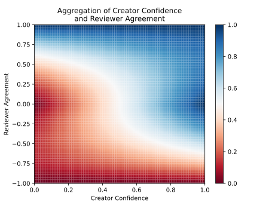

# Confidence

SSSOM enables annotating confidence in several ways for individual mappings
records and for mapping sets.

## Confidence in Positive Semantic Mappings

The following example shows a high confidence (0.99) manually curated semantic
mapping, between two disease resources.

```tsv
#curie_map:
#  mesh: https://meshb.nlm.nih.gov/record/ui?ui=
#  MONDO: http://purl.obolibrary.org/obo/MONDO_
#  oboinowl: http://www.geneontology.org/formats/oboInOwl#
#  orcid: https://orcid.org/
#  semapv: https://w3id.org/semapv/vocab/
#  skos: http://www.w3.org/2004/02/skos/core#
#mapping_set_id: https://w3id.org/biopragmatics/biomappings/sssom/positive.sssom.tsv
subject_id	subject_label	predicate_id	object_id	object_label	mapping_justification	author_id	confidence
MONDO:0000455	cone dystrophy	skos:exactMatch	mesh:D000077765	Cone Dystrophy	semapv:ManualMappingCuration	orcid:0000-0003-4423-4370 .99
```

The following example shows a medium-confidence semantic mapping produced
through a lexical matching process. While this semantic mapping is actually
incorrect, the lexical matching process assigned it a confidence of 0.65.

```tsv
#curie_map:
#  DOID: http://purl.obolibrary.org/obo/DOID_
#  orcid: https://orcid.org/
#  semapv: https://w3id.org/semapv/vocab/
#  skos: http://www.w3.org/2004/02/skos/core#
#  umls: https://uts.nlm.nih.gov/uts/umls/concept/
#mapping_set_id: https://w3id.org/biopragmatics/biomappings/sssom/negative.sssom.tsv
subject_id	subject_label	predicate_id	object_id	object_label	mapping_justification   confidence
DOID:0050052	Rocky Mountain spotted fever	skos:exactMatch	umls:C0035795	Rocky mountain spotted fever vaccine	semapv:LexicalMapping	0.65
```

When not explicitly specified, confidence estimation algorithms should consider
the confidence of a semantic mapping to be 1.0 by default.

## Confidence with Negated Semantic Mappings

SSSOM has explicit support for curating negative semantic mappings (i.e.,
subject-predicate-object triples known to be false) by using the
`predicate_modifier` column.

The following example shows a highly confident negative semantic mapping,
because _Rocky Mountain spotted fever_ (a disease curated in DOID) is not the
same as _Rocky mountain spotted fever vaccine_ (a vaccine curated in UMLS).

```tsv
#curie_map:
#  DOID: http://purl.obolibrary.org/obo/DOID_
#  orcid: https://orcid.org/
#  semapv: https://w3id.org/semapv/vocab/
#  skos: http://www.w3.org/2004/02/skos/core#
#  umls: https://uts.nlm.nih.gov/uts/umls/concept/
#mapping_set_id: https://w3id.org/biopragmatics/biomappings/sssom/negative.sssom.tsv
subject_id	subject_label	predicate_id	predicate_modifier	object_id	object_label	mapping_justification	author_id   confidence
DOID:0050052	Rocky Mountain spotted fever	skos:exactMatch	Not	umls:C0035795	Rocky mountain spotted fever vaccine	semapv:ManualMappingCuration	orcid:0000-0003-4423-4370   1.0
```

It's also possible to curate a negative semantic mapping with low confidence,
but this is done less commonly in practice. Both human curators and semantic
mapping prediction workflows typically focus on the production of _positive_
knowledge.

Similarly, there are a large number of trivial negative semantic mappings that
are typically ignored by curators and algorithms that consume semantic mappings.

When not explicitly specified, confidence estimation algorithms should consider
the confidence of a negative semantic mapping to be 1.0 by default.

## Estimating Overall Confidence in a Mapping Set

There are two places where the confidence in a mapping set can be reported:

1. The creator of the mapping set can report their confidence in the mapping set
   with the `mapping_set_confidence` slot in the mapping set's metadata.
2. The maintainer of a mapping set registry who indexes a mapping set can report
   their own confidence in the mapping set.

In some situations, it may be sufficient to choose a mapping set confidence
based on knowledge about the scope/domain of the mapping set, who the curators
were, etc.

Alternatively, an empirical confidence can be estimated by randomly sampling
semantic mappings from the mapping set, manually reviewing them, then reporting
the percentage that were correct as a decimal value between zero and one. This
estimate becomes more accurate as the size of the sample increases, so it's
suggested to sample a minimum 50-100 semantic mappings.

When not explicitly specified, confidence estimation algorithms should consider
the registry confidence in a mapping set to be 1.0 by default.

## Reviewer Agreement

In addition to the `confidence` slot which denotes the creator's confidence in
the accuracy of a mapping record, the `reviewer_agreement` slot allows for the
reviewer to state if they disagree or agree on a scale of $[-1, 1]$.

In the following example, the reviewer confidently agrees with the accuracy of
the mapping that was previously asserted by another curator and denotes this
with a high agreement (near 1.0):

```tsv
# curie_map:
#   CHEBI: http://purl.obolibrary.org/obo/CHEBI_
#   mesh: http://id.nlm.nih.gov/mesh/
#   orcid: https://orcid.org/
#   semapv: https://w3id.org/semapv/vocab/
#   skos: http://www.w3.org/2004/02/skos/core#
# mapping_set_id: https://github.com/mapping-commons/sssom/blob/master/examples/schema/reviewer_agreement.sssom.tsv
subject_id	subject_label	predicate_id	object_id	object_label	mapping_justification	author_id	reviewer_id	reviewer_agreement
CHEBI:10001	Visnadin	skos:exactMatch	mesh:C067604	visnadin	semapv:ManualMappingCuration	orcid:0000-0001-9439-5346	orcid:0000-0003-4423-4370	0.99
```

In the following example, a semantic mapping was predicted by the
[Biomappings](https://www.wikidata.org/wiki/Q111239110) workflow. The reviewer
confidently disagrees with the accuracy of the mapping, and denotes this by
adding a low agreement (near -1.0):

```tsv
# curie_map:
#   CHEBI: http://purl.obolibrary.org/obo/CHEBI_
#   mesh: http://id.nlm.nih.gov/mesh/
#   orcid: https://orcid.org/
#   semapv: https://w3id.org/semapv/vocab/
#   skos: http://www.w3.org/2004/02/skos/core#
#   wikidata: http://www.wikidata.org/entity/
# mapping_set_id: https://github.com/mapping-commons/sssom/blob/master/examples/schema/reviewer_agreement.sssom.tsv
subject_id	subject_label	predicate_id	object_id	object_label	mapping_justification	mapping_tool_id	reviewer_id	reviewer_agreement
CHEBI:10057	9H-xanthene	skos:exactMatch	mesh:C002563	xanthan gum	semapv:ManualMappingCuration	wikidata:Q111239110	orcid:0000-0003-4423-4370	-0.00
```

In the following example, a semantic mapping was predicted by the
[Biomappings](https://www.wikidata.org/wiki/Q111239110) workflow. Because MeSH
does not include detailed information about the chemical's structure, it's not
clear to the reviewer if it should be mapped or not. Therefore, the reviewer
denotes they are unsure of whether the semantic mapping is correct or not with
an agreement of 0.0 (halfway between 1.0 for fully agree and -1.0 for fully
disagree).

```tsv
# curie_map:
#   CHEBI: http://purl.obolibrary.org/obo/CHEBI_
#   mesh: http://id.nlm.nih.gov/mesh/
#   orcid: https://orcid.org/
#   semapv: https://w3id.org/semapv/vocab/
#   skos: http://www.w3.org/2004/02/skos/core#
# mapping_set_id: https://github.com/mapping-commons/sssom/blob/master/examples/schema/reviewer_agreement.sssom.tsv
subject_id	subject_label	predicate_id	object_id	object_label	mapping_justification	mapping_tool_id	reviewer_id	reviewer_agreement
CHEBI:127105	tribromosalicylanilide	skos:exactMatch	mesh:C004361	tribromsalan	semapv:LexicalMatching	wikidata:Q111239110	orcid:0000-0003-4423-4370	0.0
```

## Aggregating Confidence for a Semantic Mapping Record

[Hoyt et al. (2025)](https://doi.org/10.1093/bioinformatics/btaf542) proposed a
model for aggregating confidences on semantic mappings that was implemented in
the
[Semantic Mapping Reasoner and Assembler](https://github.com/biopragmatics/semra).
With the introduction of reviewer agreements, this section proposes one
potential way of using it to weight confidence:

$$f(c,r)=(1−\left| r \right|)\times c+\left| r \right|\times \frac{r + 1}{2}$$

with creator confidence ($c$) and reviewer agreement ($r$). The
$\frac{r + 1}{2}$ term reweights the agreement score to work better on the
$[0,1]$ range.

This function has the nice properties:

1. When the reviewer's agreement is closer to 0.0, it doesn't have an effect on
   the creator's confidence
2. When the reviewer's agreement is closer to -1.0 or 1.0, it should override
   the creator's confidence proportionally to how close it is to the extremes

Here's how it looks over all possible values for the creator confidence and
reviewer agreement:



<details>
 <summary>Code that produced this chart</summary>

```python
import matplotlib.pyplot as plt
import numpy as np

def aggregate(c: float, r: float) -> float:
    w = np.abs(r)
    return (1 - w) * c + w * (r + 1) / 2

reviewer, creator = np.meshgrid(np.linspace(-1, 1, 100), np.linspace(0, 1, 100))
z = aggregate(creator, reviewer)
fig, ax = plt.subplots()
mesh = ax.pcolormesh(creator, reviewer, z, cmap="RdBu")
ax.set_xlabel("Creator Confidence")
ax.set_ylabel("Reviewer Agreement")
ax.set_title("Aggregation of Creator Confidence\nand Reviewer Agreement")
ax.axis([0, 1, -1, 1])
fig.colorbar(mesh, ax=ax)
plt.show()
plt.savefig("images/reviewer-agreement-aggregation.svg")
```

</details>
