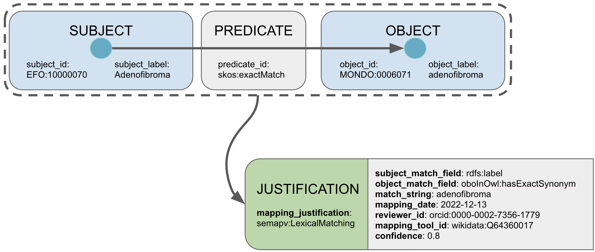

## Getting Started with SSSOM

Pre-requisites:

- You know [what a mapping is](explanation/mappings.md).

### Creating SSSOM files

SSSOM files are typically created as spreadsheets and shared as TSV files. Tools
exist to translate SSSOM files in TSV format into other formats such as JSON and
RDF. The ability to curate SSSOM files as spreadsheets makes them accessible,
especially in scientific communities, compared to more technical formats such as
JSON or RDF. However, this simplicity comes with trade-offs — spreadsheet-based
curation can make it harder to ensure that files are valid (see
[this discussion](https://github.com/mapping-commons/sssom/discussions/428)).
Using a proper validation tool (see [below](#validating-your-sssom-files)) is
therefore strongly recommended.

Let's look at a real-world example: mappings between the
[Human Phenotype Ontology (HP)](https://hpo.jax.org/) and the
[Mammalian Phenotype Ontology (MP)](http://www.informatics.jax.org/vocab/mp_ontology),
derived from the [uPheno](https://github.com/obophenotype/upheno) project.

| subject_id | subject_label             | predicate_id    | object_id  | object_label              | mapping_justification  |
| ---------- | ------------------------- | --------------- | ---------- | ------------------------- | ---------------------- |
| HP:0000175 | Cleft palate              | skos:exactMatch | MP:0000111 | cleft palate              | semapv:LexicalMatching |
| HP:0000252 | Microcephaly              | skos:exactMatch | MP:0000433 | microcephaly              | semapv:LexicalMatching |
| HP:0000822 | Hypertension              | skos:exactMatch | MP:0000231 | hypertension              | semapv:LexicalMatching |
| HP:0001596 | Alopecia                  | skos:exactMatch | MP:0000414 | alopecia                  | semapv:LexicalMatching |
| HP:0001627 | Abnormal heart morphology | skos:exactMatch | MP:0000266 | abnormal heart morphology | semapv:LexicalMatching |

A SSSOM file contains two main sections:

1. A header
2. The mappings

The header contains additional metadata about the mapping set, such as the
license or description:

```yaml
# curie_map:
#   HP: http://purl.obolibrary.org/obo/HP_
#   MP: http://purl.obolibrary.org/obo/MP_
#   owl: http://www.w3.org/2002/07/owl#
#   rdf: http://www.w3.org/1999/02/22-rdf-syntax-ns#
#   rdfs: http://www.w3.org/2000/01/rdf-schema#
#   semapv: https://w3id.org/semapv/vocab/
#   skos: http://www.w3.org/2004/02/skos/core#
#   sssom: https://w3id.org/sssom/
# license: https://creativecommons.org/publicdomain/zero/1.0/
# mapping_provider: http://purl.obolibrary.org/obo/upheno.owl
# mapping_set_id: https://w3id.org/sssom/mappings/27f85fe9-8a72-4e76-909b-7ba4244d9ede
```

You can look at an example TSV file
[on GitHub](https://github.com/mapping-commons/sssom/blob/master/examples/embedded/mp-hp-exact-0.0.1.sssom.tsv).

#### Basic anatomy of a mapping



You should think of a mapping in the SSSOM-sense as a triple between a subject
(the "mapping source") and an object (the "mapping target") via a predicate
(such as "exact match"). In SSSOM, every mapping can have a lot of metadata
associated with it, like who created it (creator_id), and when, and how
confident we are in its truthfulness.

Conceptually, we consider the sum total of all metadata collected for a mapping
its "justification" - essentially the "evidence" provided towards the mapping.

#### Identifiers in SSSOM

SSSOM files use so-called CURIEs (Compact URIs) to identify the subject and
object of a mapping. As you can see in the example in the previous section, the
object of the first mapping is `MP:0000111`, a term from the Mammalian Phenotype
Ontology. As you can see in the mandatory `curie_map`, the `MP` prefix
represents the `http://purl.obolibrary.org/obo/MP_` namespace. Using a
`curie_map` serves two purposes (1) it unambiguously identifies the entity being
mapped. Prefixes can clash easily: the prefix `ICD` all by itself can refer to
ICD-10 Clinical Modification, ICD-10 WHO Edition, ICD-11 Foundation, ICD-11 MMS
Linearisation, ICD-9, etc. (2) they serve as the prefix expansion instruction
for RDF serialisations. To convert for example `MP:0000111` into an RDF entity,
we first expand it to `http://purl.obolibrary.org/obo/MP_0000111`.

!!! warning "Why can't I use URIs instead of CURIEs in my TSV file?"

    The SSSOM/TSV format requires all identifiers to be in CURIE form. This is enforced by SSSOM validators.
    CURIEs are much more readable than full URIs/URLs, making your mapping files more compact and easier to work with.
    All prefixes used in your CURIEs must be declared in the `curie_map`.

#### Mapping predicates

The `predicate_id` specifies the mapping relation between subject and object.
Any predicate identifier may be used, but if you are just getting started, it is
best to stick to the
[common predicates](spec/dev/model.md#allowed-and-common-mapping-predicates). The
most frequently used ones are:

| Predicate           | When to use                                                                     |
| ------------------- | ------------------------------------------------------------------------------- |
| `skos:exactMatch`   | The subject and object can be used interchangeably in most contexts.            |
| `skos:broadMatch`   | The object is a broader/more general concept than the subject.                  |
| `skos:narrowMatch`  | The object is a narrower/more specific concept than the subject.                |
| `skos:closeMatch`   | The two are similar enough to be interchangeable in some contexts, but not all. |
| `skos:relatedMatch` | The two are associated in some way, but not interchangeable.                    |

#### Basic SSSOM Metadata

Every SSSOM mapping set has two levels of metadata: metadata about the _mapping
set_ as a whole, and metadata about each _individual mapping_.

**Required metadata for the mapping set** (see [MappingSet](spec/MappingSet.md) for
the full description of all fields):

| Field            | Description                                                                                                         |
| ---------------- | ------------------------------------------------------------------------------------------------------------------- |
| `mapping_set_id` | A globally unique identifier (URI) for this mapping set, e.g. `https://w3id.org/sssom/tutorial/example1.sssom.tsv`. |
| `license`        | A URL to the license, e.g. `https://creativecommons.org/licenses/by/4.0/`.                                          |
| `curie_map`      | A dictionary that maps CURIE prefixes to their IRI expansions.                                                      |

Other commonly used set-level metadata includes `mapping_set_description`,
`mapping_set_version`, `subject_source`, `object_source`, and `creator_id`.

**Required metadata for each mapping** (see [Mapping](spec/Mapping.md) for the full
description of all fields):

| Field                   | Description                                                          |
| ----------------------- | -------------------------------------------------------------------- |
| `subject_id`            | The CURIE of the entity being mapped (the "source").                 |
| `predicate_id`          | The mapping relation (e.g. `skos:exactMatch`).                       |
| `object_id`             | The CURIE of the entity being mapped to (the "target").              |
| `mapping_justification` | How the mapping was determined, e.g. `semapv:ManualMappingCuration`. |

Other commonly used mapping-level metadata includes `subject_label`,
`object_label`, `confidence`, `author_id`, `mapping_date`, and `comment`.

For a comprehensive list, see the
[Quick reference for mapping metadata](index.md#quick-reference-for-mapping-metadata).

#### Mapping justifications

Every mapping in SSSOM must come with a justification - an indication of _how_
the mapping was established. You can think of it as the "evidence type" for the
mapping. Justifications are terms from the
[Semantic Mapping Vocabulary (SEMAPV)](https://mapping-commons.github.io/semantic-mapping-vocabulary/),
specifically the terms under
[`MatchingProcess`](https://www.ebi.ac.uk/ols4/ontologies/semapv/classes/https%253A%252F%252Fw3id.org%252Fsemapv%252Fvocab%252FMatching?lang=en).

Some common justifications:

| Justification                                | When to use                                                                     |
| -------------------------------------------- | ------------------------------------------------------------------------------- |
| `semapv:ManualMappingCuration`               | A human curator determined that the mapping is correct.                         |
| `semapv:LexicalMatching`                     | The mapping was established by matching labels or synonyms.                     |
| `semapv:LogicalReasoning`                    | The mapping was inferred through logical reasoning.                             |
| `semapv:SemanticSimilarityThresholdMatching` | The mapping was established by computing semantic similarity above a threshold. |
| `semapv:MappingReview`                       | The mapping was determined through a formal review process.                     |

If you are manually curating your mappings, `semapv:ManualMappingCuration` is
the right choice. For more detail on how to construct more nuanced
justifications, see the
[Guide to using Mapping Justifications](mapping-justifications.md).

<a id="validating-your-sssom-files"></a>

#### Validating your SSSOM files

To check that your SSSOM files are valid, you can use the
[SSSOM Toolkit](toolkit.md) (also known as `sssom-py`). After
[installing it](https://mapping-commons.github.io/sssom-py/installation.html),
you can validate a file like this:

```bash
$ wget https://w3id.org/biopragmatics/biomappings/sssom/biomappings.sssom.tsv
$ pip install sssom-py
$ sssom validate biomappings.sssom.tsv
```

This will check that all required fields are present, that the CURIEs are
properly declared in the `curie_map`, and that values conform to the expected
types.

Alternatively, if you prefer a Java-based tool,
[sssom-java](https://incenp.org/dvlpt/sssom-java/)'s `sssom-cli` can also
validate SSSOM files. See the
[sssom-cli examples](https://incenp.org/dvlpt/sssom-java/sssom-cli/examples.html)
for details.

#### Converting SSSOM files into other formats

The SSSOM Toolkit can convert your TSV mapping sets into other formats:

```bash
sssom convert my-mappings.sssom.tsv --output my-mappings.owl --output-format owl
sssom convert my-mappings.sssom.tsv --output my-mappings.json --output-format json
```

[sssom-java's `sssom-cli`](https://incenp.org/dvlpt/sssom-java/sssom-cli/examples.html)
can also convert between formally defined SSSOM serialisation formats (TSV,
JSON, and RDF/Turtle).

For detailed information about the different serialisation formats, see
[SSSOM/TSV](spec/formats-tsv.md), [OWL/RDF](spec/formats-owl.md), and
[JSON](spec/formats-json.md).

#### Storing and sharing SSSOM files

SSSOM files are plain text (TSV), so they can be stored and version-controlled
just like any other text file, for example in a GitHub repository. If your
mappings are converted to RDF, they can also be loaded into a triple store or
ontology repository.

You may also choose to develop your mapping file in a columnar format like Excel
or Google Sheets, and then convert to TSV. For many people this will be the
easiest way to work with mapping files. Those with GitHub Actions experience can
automate the conversion whenever source files change.

### Using SSSOM files

So far we have focused on how to _create_ SSSOM files. But what can you actually
_do_ with them?

#### Programmatic access with sssom-py

The [SSSOM Toolkit](https://mapping-commons.github.io/sssom-py) provides a
Python API for loading, manipulating, and querying mapping sets:

```python
from sssom.parsers import parse_sssom_table

# Load an SSSOM TSV file
msdf = parse_sssom_table("my-mappings.sssom.tsv")

# Access the mapping set metadata
print(msdf.metadata)

# Access the mappings as a pandas DataFrame
df = msdf.df
print(df.head())
```

#### Common operations with the SSSOM Toolkit

The SSSOM Toolkit CLI supports a range of useful operations. Here are some of
the most common ones:

- **Merging** mapping sets from different sources into one:

  ```bash
  sssom merge mappings1.sssom.tsv mappings2.sssom.tsv --output merged.sssom.tsv
  ```

- **Filtering** mappings, for example by predicate:

  ```bash
  sssom filter my-mappings.sssom.tsv --predicate_id skos:exactMatch -o exact-only.sssom.tsv
  ```

- **Diffing** two mapping sets to see what changed:

  ```bash
  sssom diff mappings-v1.sssom.tsv mappings-v2.sssom.tsv --output diff.tsv
  ```

For a more detailed walkthrough, see the [SSSOM Toolkit guide](toolkit.md) and
the [sssom-py documentation](https://mapping-commons.github.io/sssom-py).

#### Using SSSOM in Java with sssom-java

[sssom-java](https://github.com/gouttegd/sssom-java) is a Java implementation of
SSSOM developed by Damien Goutte-Gattat. It provides reading and writing support
for SSSOM/TSV and JSON formats, and can be used as a library in your own Java
applications or as a [ROBOT](http://robot.obolibrary.org/) plugin.

To add sssom-java to your Maven project:

```xml
<dependency>
    <groupId>org.incenp</groupId>
    <artifactId>sssom-core</artifactId>
    <version>1.10.0</version>
</dependency>
```

Reading and iterating over mappings:

```java
import org.incenp.obofoundry.sssom.TSVReader;
import org.incenp.obofoundry.sssom.model.MappingSet;
import org.incenp.obofoundry.sssom.model.Mapping;

TSVReader reader = new TSVReader("my-mappings.sssom.tsv");
MappingSet ms = reader.read();

for (Mapping m : ms.getMappings()) {
    System.out.printf("%s -[%s]-> %s%n",
        m.getSubjectId(), m.getPredicateId(), m.getObjectId());
}
```

Writing a mapping set back to TSV:

```java
import org.incenp.obofoundry.sssom.TSVWriter;

TSVWriter writer = new TSVWriter("output.sssom.tsv");
writer.write(ms);
```

sssom-java also ships with a
[ROBOT plugin](https://github.com/gouttegd/sssom-java) that can extract
cross-references from OWL ontologies into SSSOM format, inject mapping-derived
axioms into ontologies, and more. For the full documentation, see the
[sssom-java homepage](https://incenp.org/dvlpt/sssom-java/).

#### Using SSSOM in the Ontology Development Kit (ODK)

The
[Ontology Development Kit (ODK)](https://github.com/INCATools/ontology-development-kit)
comes with built-in support for SSSOM. If you are maintaining an ontology using
the ODK, you can manage your mappings alongside your ontology source files and
have them automatically validated as part of your build process. For an example,
see the how
[Uberon manages its mappings](https://github.com/obophenotype/uberon/blob/master/src/ontology/uberon-odk.yaml).

### Where to go from here

- [Detailed SSSOM curation tutorial](tutorial.md) - a step-by-step guide on how
  to curate SSSOM mapping sets from scratch.
- [Mapping justifications](mapping-justifications.md) - learn how to construct
  more nuanced mapping justifications.
- [SSSOM Toolkit guide](toolkit.md) - learn how to use the SSSOM command line
  tools.
- [SSSOM data model](spec/model.md) - the full specification of the SSSOM data
  model.
- [Training materials](training.md) - video tutorials and external guides.
