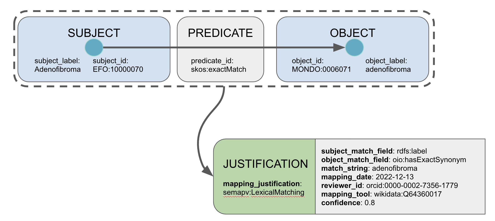

## Getting Started with SSSOM

Pre-requisties:

- You know [what a mapping is](explanation/mappings.md).

### Creating SSSOM files

SSSOM files are typically created as spreadsheets and shared as TSV files.
Tools exist to translate SSSOM files in TSV format into other formats such as JSON and RDF.
In our experience, the ability to curate SSSOM files as spreadsheets vastly improves its uptake, especially in scientific communities, compared to more technical formats such as JSON or RDF.

Lets start with the the example we created as part of our [detailed SSSOM curation tutorial](tutorial.md).

| subject_id | subject_label | predicate_id | object_id | object_label | confidence | comment | mapping_justification | mapping_date | author_id | subject_source_version | object_source_version |
| --- | --- | --- | --- | --- | --- | --- | --- | --- | --- | --- | --- |
| KF_FOOD:F001 | apple | skos:exactMatch | FOODON:00002473 | apple (whole) | 0.95 | We could map to FOODON:03310788 instead to cover sliced apples, but only "whole" apple types exist. | semapv:HumanCuration | 2022-05-02 | orcid:0000-0002-7356-1779 | | http://purl.obolibrary.org/obo/foodon/releases/2022-02-01/foodon.owl |
| KF_FOOD:F002 | gala | skos:exactMatch | FOODON:00003348 | Gala apple (whole) | 1 | | semapv:HumanCuration | 2022-05-02 | orcid:0000-0002-7356-1779 | | http://purl.obolibrary.org/obo/foodon/releases/2022-02-01/foodon.owl |
| KF_FOOD:F003 | pink | skos:exactMatch | FOODON:00004186 | Pink apple (whole) | 0.9 | We could map to FOODON:00004187 instead which more specifically refers to "raw" Pink apples. Decided against to be consistent with other mapping choices. | semapv:HumanCuration | 2022-05-02 | orcid:0000-0002-7356-1779 | | http://purl.obolibrary.org/obo/foodon/releases/2022-02-01/foodon.owl |
| KF_FOOD:F004 | braeburn | skos:exactMatch | sssom:NoMapping | | 1 | | semapv:HumanCuration | 2022-05-02 | orcid:0000-0002-7356-1779 | | http://purl.obolibrary.org/obo/foodon/releases/2022-02-01/foodon.owl |
| KF_FOOD:F004 | braeburn | skos:broadMatch | FOODON:00002473 | apple (whole) | 1 | | semapv:HumanCuration | 2022-05-02 | orcid:0000-0002-7356-1779 | | http://purl.obolibrary.org/obo/foodon/releases/2022-02-01/foodon.owl |

A SSSOM file contains two main sections:

1. A header
2. The mappings

The header contains additional metadata about the mapping, such as the license or description:

```yaml
# curie_map:
#   FOODON: http://purl.obolibrary.org/obo/FOODON_
#   KF_FOOD: https://kewl-foodie.inc/food/
#   orcid: https://orcid.org/
#   owl: http://www.w3.org/2002/07/owl#
#   rdf: http://www.w3.org/1999/02/22-rdf-syntax-ns#
#   rdfs: http://www.w3.org/2000/01/rdf-schema#
#   semapv: https://w3id.org/semapv/vocab/
#   skos: http://www.w3.org/2004/02/skos/core#
#   sssom: https://w3id.org/sssom/
#   wikidata: https://www.wikidata.org/wiki/
# license: https://creativecommons.org/licenses/by/4.0/
# mapping_date: '2022-05-02'
# mapping_set_description: Manually curated alignment of KEWL FOODIE INC internal food
#   and nutrition database with Food Ontology (FOODON). Intended to be used for ontological
#   analysis and grouping of KEWL FOODIE INC related data.
# mapping_set_id: https://w3id.org/sssom/tutorial/example1.sssom.tsv
# mapping_set_version: '2022-05-01'
# object_source: wikidata:Q55118395
# object_source_version: http://purl.obolibrary.org/obo/foodon/releases/2022-02-01/foodon.owl
# subject_source: KF_FOOD:DB
```

You can look at an example TSV file [on GitHub](https://github.com/mapping-commons/sssom/blob/master/examples/embedded/foodie-inc-2022-05-01.sssom.tsv).

#### Basic anatomy of a mapping



You should think of a mapping in the SSSOM-sense as a triple between a subject (the "mapping source") and an object (the "mapping target") via a predicate, such as "exact match"). In SSSOM, every mapping can have a lot metadata associated with it, like who created it (creator_id), and when, and how confident we are in its truthfulness.

Conceptually, we consider the sumtotal of all metadata collected for a mapping its "justification" - essentially the "evidence" provided towards the mapping.

#### Identifiers in SSSOM

SSSOM files use so called CURIEs (Compact URIs) to identify the subject and object of a mapping. As you can see in the example in the previous section, the object of the first mapping is `FOODON:00002473`, a term from the FOODON ontology.
As you can see in the mandatory `curie_map`, the `FOODON` prefix represents the `http://purl.obolibrary.org/obo/FOODON_` "namespace" used by the [FOODON ontology](https://foodon.org/).
Using a `curie_map` serves two purposes (1) it unambiguously identfies the entity being mapped. Prefixes can clash easily: the prefix `ICD` all by itself can refer to ICD-10 Clinical Modification, ICD-10 WHO Edition, ICD-11 Foundation, ICD-11 MMS Linearisation, ICD-9, etc. (2) they serve as the prefix expansion instruction for RDF serialisations. To convert for example `FOODON:00002473` into and RDF entity, we first expand it to `http://purl.obolibrary.org/obo/FOODON_00002473`.

!!! warning Why cant I use URIs instead of CURIEs in my TSV file?

    CURIEs have been developed as a much more readable variant of full URIs/URLs. Using them makes your whole mapping file more readable, and more compact.
    We strongly suggest to using CURIEs instead of URIs to ensure that the SSSOM mappings are more easily created and used by humans.
    If you must, you can use URIs by exploiting a simple hack in the `curie_map`: 
    Simply adding `https: https`, declaring that the `https` prefix expands to the `https` URI prefix.

#### Basic SSSOM Metadata

# ----------- ONLY WAS ABLE TO GET TO HERE ---------------

The required and optional metadata fields for the mapping set are as follows (see Mapping Set metadata for the description of these fields): …

The required and optional fields for each mapping are as follows ((see Quick reference for mapping metadata for the description of these fields): …

You can find mapping justifications (the only other required term aside from the mapping object ID) in the semapv vocabulary(Ed: Except I can't, there is no word 'justification' in that document so how can one look up the justifications?), specifically the terms under the 'matching process' concept', also called 'Matching'. For manually created mappings a simple justification is semapv:ManualMappingCuration. (Ed: Except said identifier/link doesn't resolve directly to the term, only to the vocabulary.)
To validate your SSSOM files you will need to install and work with the SSSOM Toolkit, or the related Ontology Development Kit documented on that page.

#### Converting SSSOM files into other formats

Of course your mapping sets (CSV, RDF, or JSON) are text files, and can be stored in a repository such as GitHub. If your mappings are converted to valid RDF format, you can store the RDF in any suitable ontology repository. For now no other mapping-dedicated repositories exist, though some are under development or proposed.

### Using SSSOM files